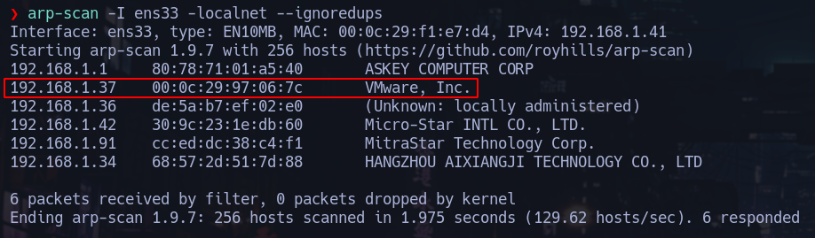

 

# Fase de reconocimiento
---
Empezamos realizando un escaneo con `arp-scan` a la red para averiguar la IP de la máquina:
 


Ahora realizamos un `ping` a la máquina para ver si nos responde.
Vemos que el *TTL* es *64* lo que nos indica que es una máquina **Linux**


Empezamos ahora el reconocimiento de los puertos utilizando `nmap`, primero
escaneamos todo el rango de puertos.


Ahora sobre estos puertos, hacemos un escaneo más profundo para detectar versión y servicio.
Vemos que `nmap` detecta que hay un repositorio git bajo la ruta `192.168.1.37:80/.git`


# Fase de explotación
---
## GitHub información expuesta
Investigando en el repositorio, encuentro los commits que se han ido haciendo.
Llama la atención el segundo commit, donde dice que ha puesto las credenciales por defecto en el `login.php`.


Nos traemos el repositorio a nuestra máquina con `wget -r <ruta>` para trabajar mejor y ahora dentro del repositorio hacemos `git show <hash_commit>` para ver los cambios que se han realizado en ese commit.
Con esto obtenemos el email `lush@admin.com` y la password `321` que nos sirven para hacer login en `login.php`.


## SQLI

Después de hacer login, examindo esta nueva página, vemos que se produce un la SQL bajo el parámetro `id`.


Una vez que hemos detectado que se produce un SQLI, dectamos el número de columnas que se están representando utilizando `order by` para después ir mostrando información de la base de datos. En este caso es *6*.


El siguiente paso es mostrar las bases de datos que existen. En este caso utilizamos `group_concat()` para agrupar toda la salida en una sola columna y así poder verla en la web. (Hacer url encode en la query para que no haya problemas).

```sql
2'union select 1,group_concat(schema_name),3,4,5,6 from information_schema.schemata-- -
```

Después obtenemos las tablas que hay en la base de datos `darkhole_2`.

```sql
2'union select 1,group_concat(table_name),3,4,5,6 from information_schema.tables-- -
```

Ahora obtenemos las columnas de la tabla `ssh`

```sql
2'union select 1,group_concat(column_name),3,4,5,6 from information_schema.columns where table_schema='darkhole_2' and table_name='ssh'-- - 

```

Finalmente mostramos la información de las columnas para la tabla `ssh`

```sql
2'union select 1,group_concat(id,user,":",pass),3,4,5,6 from ssh -- -
```

Llegados a este punto obtenemos el usuario `jehad` y la contraseña `fool` que podremos utilizar para conectarnos por `ssh` a la máquina.

# Escalada de privilegios
---

Una vez concetados a la máquina como el usuario `fool`, vamos a hacer un reconociemintoutilizando la herramienta [Linpeas](https://github.com/carlospolop/PEASS-ng/tree/master/linPEAS).
Vemos que bajo la ruta `/opt/web` el usuario `losy` esta proporcionando un servidor web por el puerto `9000`. Además inspeccionando el archivo `index.php` vemos que se pueden ejecutar comandos a través del parámetro `cmd` en la url.


Como tenemos ejecución de comandos bajo el usuario `losy`, entablamos una **Reverse shell**.


## Escalada a Root

Observando el `.bash_history` de `losy` encontramos una posible credencial.


Ahora con la credencial podemos mirar si podemos ejecutar algún binario con `sudo`, para ello, ejecutamos `sudo -l`. Vemos que podemos ejecutar `python3` como si fuesemos `root`


Ahora convertirse en `root` es tarea sencilla, simplemente ejecutamos `sudo /usr/bin/python3 -c 'import os; os.system("/bin/sh")'` y ya estaríamos como `root`.


